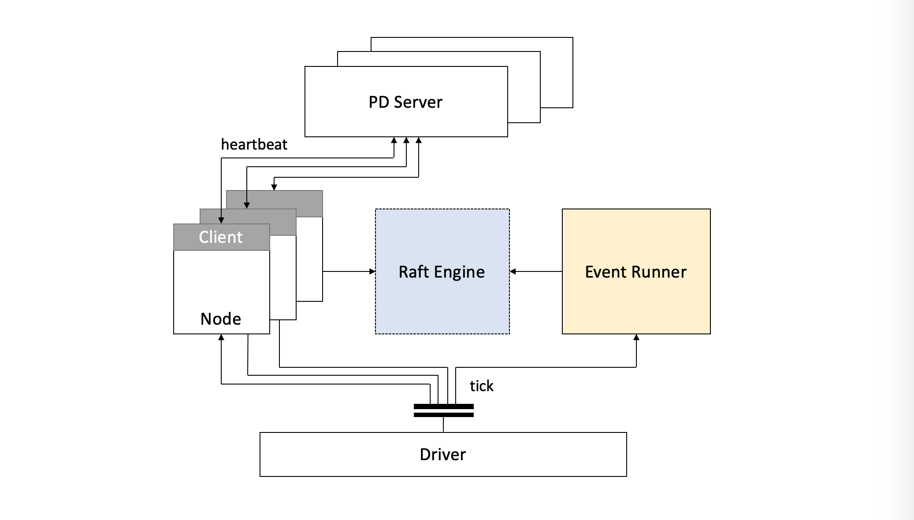

# PD Simulator

## Summary

This RFC proposes a new tool named **Simulator** in PD. It is used to simulate
different cases in real scenarios in order to evaluate the correctness and
performance of scheduling of PD.

## Motivation

Currently, it's a little bit hard to tell if the PD has some scheduling problems
under certain circumstances. Also, in the test environment, it's unrealistic to
deploy hundreds of TiKV to test the performance of PD under high pressure
situations where high concurrency requests exist.

Therefore, we need to construct a tool to simulate a large number of TiKVs in
order to mock the real network communication between TiKV and PD.

## Detailed design

### Architecture



#### Driver

`Driver` is the most important part of PD Simulator. It is used to do some
initialization and trigger the heartbeat and the corresponding event according
to the tick count. The definition of `Driver` can be designed as follows:

```golang
type Driver struct {
    // addr specifies PD address which can be either a real PD or just an
    // internal test server. The benefit of the test server is that we can speed
    // up the scheduling process by adjusting the tick interval.
    addr            string
    // tickCount is used to trigger the corresponding heartbeat and event.
    tickCount       int64
    // eventRunner manages all events (e.g. add/delete nodes, hot read/write,
    // ...), which will be executed.
    eventRunner     *EventRunner
    // raftEngine_ records all Raft related information. Since PD doesn't care
    // about how Raft layer works, it's not necessary to implement a real Raft
    // layer here. We can simplify the logic by using a shared `raftEngine`.
    raftEngine      *RaftEngine
    // connection records the information of nodes.
    connection      *Connection
}
```

#### Node

`Node` is used to simulate a TiKV. The definition is designed as follows:

```golang
type Node struct {
    *metapb.Store
    // client in `Node` is responsible for sending the store heartbeat and the
    // Region heartbeat to PD through gRPC. This “deceives” PD as it
    // communicates with a real TiKV cluster.
    client                   Client
    // receiveRegionHeartbeatCh is a channel to receive the Region heartbeat
    // from PD.
    receiveRegionHeartbeatCh <-chan *pdpb.RegionHeartbeatResponse
    // tasks is used to store `Task`s (`Task` is an interface which defines and
    // executes some Raft commands on the shared `raftEngine`, e.g. adding a
    // learner and removing a peer, ...) which are converted by the PD
    // responses.
    tasks                    map[uint64]Task
    // raftEngine is shared by each node as mentioned above.
    raftEngine               *RaftEngine
```

#### Event

`Event` is an interface which supports custom implementations. For every tick,
the `eventRunner` will execute the `Run` function. The concrete definition is
designed as follows:

```golang
type Event interface {
    Run(tickCount int64) bool
}
```

It runs the predefined events according to the `tickCount`. The return value
indicates if the event is finished.

### Basic process

To run the simulator, we need to write the case which we want to test. The basic
case usually consists of these parts:

- Stores: It is related to stores' settings including number, status, capacity,
  etc.
- Regions: It is related to Regions' settings including number, distribution,
  etc.
- RegionSplitSize (optional): When the size of a Region exceeds it, the Region
  will split.
- RegionSplitKeys (optional): When the number of keys of a Region exceeds it,
  the Region will split.
- Events: It defines the event the case will run. If we don't need it, we can
  initialize it with an empty list.
- Checker: It checks if the case runs as expected.

When we start the simulator, it will first create a driver, which will initilize
the mocking TiKV cluster according to the specified case. After the PD is
bootstrapped, it will start to run a timer. The driver will trigger each node to
send the heartbeat to PD according to the tick count. In order to simulate a
real TiKV cluster's behavior, for each tick, it will execute some Raft logic,
such as leader election, Region split, on a shared `raftEngine` if needed and
execute the events predefined in the case. Besides, after receiving the PD's
response, it will convert this response to the task, and put this task into a
task list of a node.
For each tick, it will run these tasks to execute some Raft commands on the
shared `raftEngine`.

#### Verification of correctness

To verify the correctness of the scheduling of PD. We need to define a checker.
The checker will continue to check the condition we specified. If the condition
is met, which means the scheduling result is as we expected, it will exit.
Otherwise, it will keep running until its timeout expires and then raise an
error.

#### Evaluation of performance

To evaluate the performance of PD under high concurrency requests, we can let
the condition of the checker always return false, and we can use the metrics of
PD to investigate the performance problem.

## Drawbacks

Since it's a new tool for PD, there are no drawbacks, but there are some points
could be optimized:

- The cases are written in `go`. It is necessary to recompile the code to run
  the new case. It will be better to use the configuration file to write the
  case directly.
- It needs to add some metrics for the simulator to help locate problems.
- It cannot simulate the RocksDB behavior, which needs to be improved in the
  future.

## Alternatives

None

## Unresolved questions

The case is not easy to be constructed. We need to find a way to make it easier.
